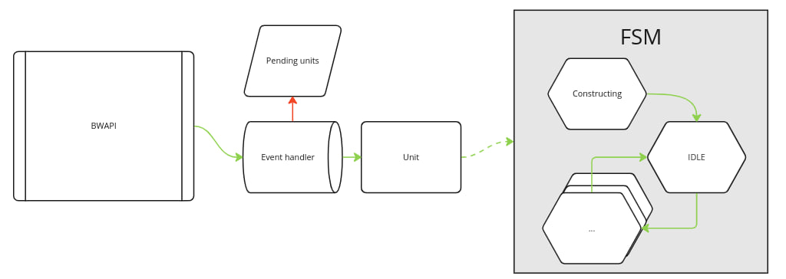

# Bot for Starcraft: BroodWar

Game AI project for l'X AI for video games course. Based on Startcraft bot and uses BWAPI.

## Architecture:

We've focused on building an environment that enables developing complex behaviors and doesn't suffer from state space growth.

### Working with BWAPI

There are four types of interactions with BWAPI available:
1. Accessing static constants (e.g. mineral price of a barrack)
2. Receiving in-game events (e.g. unit spawned)
3. Asking current game state (e.g. if unit is attacked)
4. Ordering a command (e.g. build a depot)

We access static consants from any place of the codebase, because they are not context specific. To facilitate rest of interactions, we have developed BlackBoard, Event handler and Controller.

#### Blackboard

Usually, blackboard is the structure that helps units to cooperate. Our blackboard is built slightly differently, because of the project structure. As we have BWAPI, which is main source of conflicts for our units, Blackboard aims to make all game states fully observable.

Overall, we think of BlackBoard as of only source of truth for in-game data. It stores friendly and enemy units, fetches background changes on each frame and keeps track of unit's state with an FSM.

#### Event handler

Is responsible for all the callbacks that BWAPI might call. Usually it works as a proxy that converts event to a meaningful Blackboard update.

#### Controller

Controller is an API for our units to do actions. It handles BWAPI error codes, and updates BB data on successful commands.

### Keeping track of unit's game state

In Starcraft, unit can do many things and have many different states. For instance, unit might be gathering minerals, and then ordered to construct resource supply. After the build is finished, unit still has minerals on him. BWAPI doesn't allow gathering minerals if unit already has some, and doesn't issue the command.

As we connect to the game through BWAPI, we are limited by what it allows, and often it's behavior is not documented. To avoid problems like that, we've developed a finite state machine, that keeps track of what unit is doing in game. It verifies that command is not issued when previous command isn't finished or that unit haven't started doing some unexpected behavior in-game by itself. In case of anomaly detection, exception is thrown. It was extremely useful for debugging purposes.

### Behavior tree

To make units do something, we assign them a behavior. Every unit is either IDLE or active, going through a single behavior.

We've developed a small library for behavior tree usage that operates on lambda functions. It allowed us to write easy to modify behaviors and dynamically create complex behaviors. For instance, for build order, we clone a "build command" tree, adjusting it's context for current building.

We mostly use behavior trees for micro-logic that works on unit level. Usually it describes a process (attack, defend, scout) with a set of callbacks for extreme situations.  One tree serves one goal.

### Planner

To coordinate units, we have a planner available. Planner is basically a tree manager. At each frame, it asks every behavior if at the moment there is a need for them to run. If yes, behavior submits a quota request, where defines types of units needed. After that, planner sorts requests based on priority and greedily assigns as many units to a behavior as possible.

So, planner serves a global synchronization purposes. Overall, our strategy is local-first, which means we define behaviors of units in strategy, and each behavior is responsible for enabling it and doing what needs to be done. Planner helps us to avoid conflicts.

## In-Game capabilities

Our strategy provides complex build order, scouting technique, squad management for attacking enemy base. We play for Terrans.

Buildings supported:
- Supply depots
- Barracks
- Refinery
- Academy

Units trained:
- SCV
- Marines
- Medics

Upgrades issued:
- U 238 Shells 
